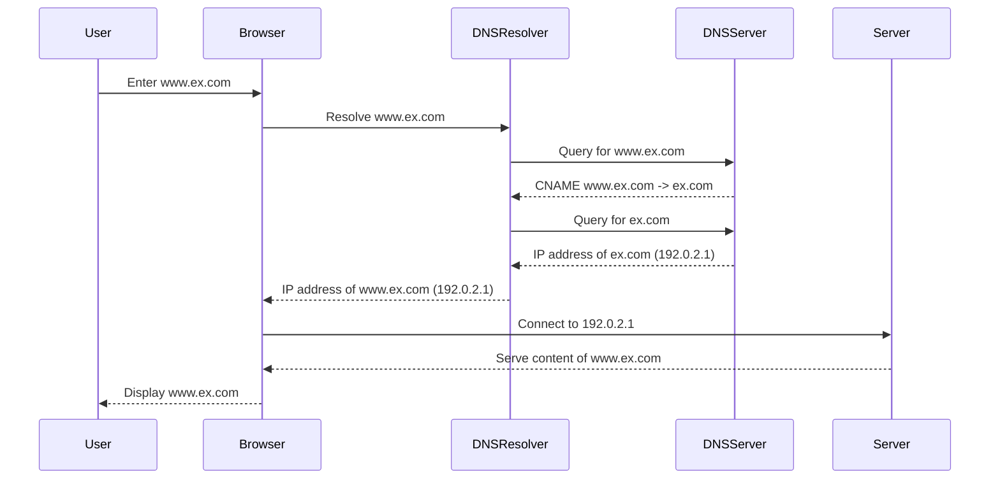

# Setting up DNS & HTTPS

In a way, this covers TLS too (practically).
nginx will be a separate one, but this one refers to that, and provides minimal commands and key concepts.

### My conceptualisaiton
(Not part of DNS's own conceptualisation)

* Nested, Partial and directional DNS resolution
    * Can be done in multiple stages, some may be "delegated" to others.
        * `a.(b.c.(d.(e.)f.g).h).d.e`
        * Can enable internal
        * Can enable "zone"s (water-tight: strictly limited)
    * The "DNS agent"
* Nested DNS resolution
    * Nestedness pattern
    * Is not unique?
* The "DNS agent"
* Directional DNS: the resolved IP may be different
* Concerns that shape this architecture:
    * Responsibility (ownership) of resolution (of "part" of the domain name)
       * Water-tightness of "zone"s
    * Latency: delay (global: maintained for large use)
    * Latency: delay (for internal: needs to be faster)
    * Historically, why did they do it in a mediated way? (for nested? or it appeared later.) Also: does "nested" cover all the reasons that architecture (protocol & "seq diagram") is used?
* What has shaped DNS:
    * Slow nature of change


* DNS as Language
   * DNS as language 1
      * `www.a.com CNAME a.com`
   * DNS as language 2
      * `CNAME www.a.com a.com`
   * DNS as language 3 (tf)
      * ```tf
         record {
             type     = "CNAME"
             hostname = "@"
             address  = "a.bcd.com"
             ttl      = 1800
        }
        ```

A sequence diagram? (The diagram below is not reviewed. Don't learn from it)

To make it short:
* `www.ex.com` instead of `www.example.com`
<!-- * "💻" instead of "Browser" -->



### Key Concepts
You need to know these so as not to get confused.

#### The Apex domain
The main one?
Is the same thing in the below DSL is represented by `@`.
aka: "root domain"  "base domain" "core domain name"

Separate: URL vs IP
* IP does not have protocol, and no subpath
* `www.my.com` is neither URL nor IP.
* (taken care of at "syntax" level)
Further: (around)
    * "domain" is (specified by) IP or domain name
    * "host" (in DNS-DSL) is ...

#### The DNS DSL!
```dns
#   <CMD>   <host>       <value>       ...
#    A      @           <domain>
     A      @           185.199.108.153
```

Language model:
* A DSL of commands like `A` `redirect` `CNAME`. With almost fixed columns.
* The "records": are DSL statements
* Is run (interpreter) by the "browser"

Machine model: (semantics)
* multiple IPs =>
* Operations: redirect. (on URL, not IP)

Syntax:
* `<domain>` → IP or domain name
* (for now, assume TTL=`automatic`, which implies ... )
* `<cmd>` →  `A` `redirect` `CNAME`
* `<host>` →  `@`, a prefix e.g. `www`, etc

Material: atom vs string content: `www` vs `@`
Sub-grammar (a bit like Au)

Mini Glossary
* record
* apex


### Key Facts
* Only redirects the domain.


## Guides/know-how
There may be better solutions. This is what I have found and have worked so far. Reproducible.

### DNS
Key steps

#### Propagation
What to do while waiting for DNS propagation.

### https
Key steps

### content
Two types of content
#### nginx
see [nginx-setup.md](./nginx-setup.md)
Nginx Solution 1: Linux VM
Nginx Solution 2: Docker container

Nginx Solution 3: k8

#### github pages
As a subpage of github. (There may be better solutions. This is what I have found and have worked so far. Reproducible.)

