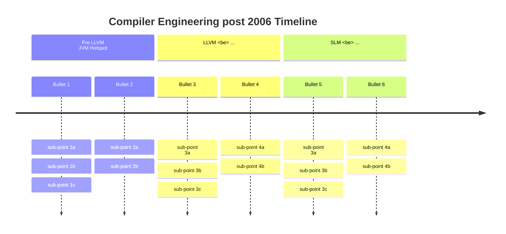

# Compilers in Age of AI, Cloud & Autonomy
<!-- of AI, AV & ML . LLM? edge (power) -->

### Preface
While looking from fantastic shoulder of giants, in the new era,
in 2024, we need a new Compiler Design text book that is more about 2024 than 1986,
and is able to get students up to working know-how as well as an academic vision for the new era.

All of these appeared after 2006:
LLVM, MLIR
Rust, Zig, Jai, Hare, Odin, Modular Mojo, C++23, and even GoLang.
Large Language Models, transformers, deep learning.
Devops, infrastructure as code.
Small Language Modesls and NN-insired compilers.
Heterogeneous computing and heterogenious cloud.
multi-cloud, hybrid cloud (heterogeneous)
Itanium died a thousand deaths [ref].

More modern approaches to concurrent.

C++20 is not aught up.
Javascript ...
Docker.

ownership, 

ANTLR4, 
Lean4,

Erlang, BEAM, or Elixir

virtualisation & Q.

* program model
* machine model
* memory model
* network model (or interconnect model)
* performance model

##### Preface: Timeline
A brief history of post-2006 CS/CE:

* 1986
   * HotSpot, JIT (2011)
* 2006
* 2006 : Hotspot license?
   * ?:ajax
   * Death of Sun ?
   * ? LLVM
* 2008:
   * private cloud (2008)
   * iPhone
   * Vulkan
   * Clang: rewrite of gcc
   * Namespaces were implemented in Linux
   * Arm taking over
* 2014
   * 2014: SyCL
* 2015
   * 2015: SPIR
   * ?: MLIR
* 2023
   * Mojo

Timeline: todo: academic mainstream terms shifts (lingo) (& paradigms).

#### .
