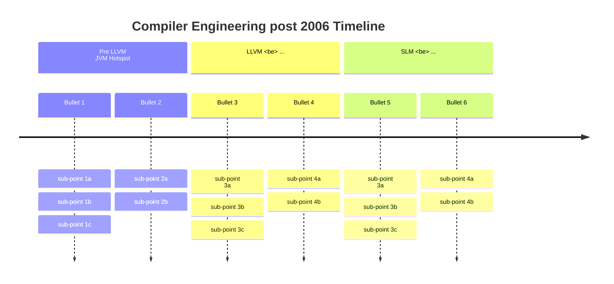
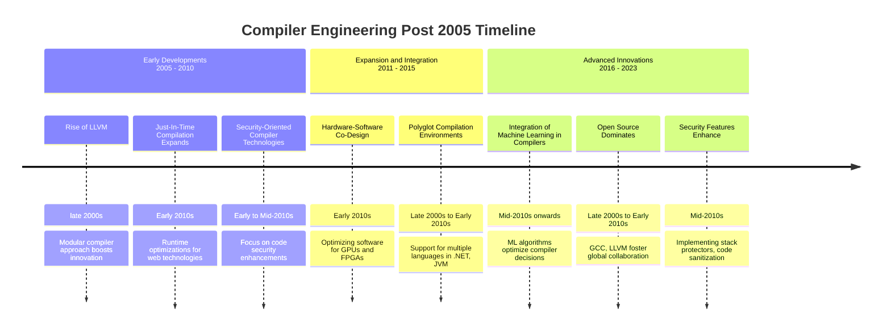

# Compilers in Age of AI, Cloud & Autonomy
<!-- of AI, AV & ML . LLM? edge (power) -->

### Preface
While looking from fantastic shoulder of giants, in the new era,
in 2024, we need a new Compiler Design text book that is more about 2024 than 1986,
and is able to get students up to working know-how as well as an academic vision for the new era.

All of these appeared after 2006:
LLVM, MLIR
Rust, Zig, Jai, Hare, Odin, Modular Mojo, C++23, and even GoLang.
Large Language Models, transformers, deep learning.
DevOps, infrastructure as code.
Small Language Models and NN-inspired compilers.
Heterogeneous computing and heterogeneous cloud.
multi-cloud, hybrid cloud (heterogeneous)
Itanium died a thousand deaths [ref].

More modern approaches to concurrent.

C++20 is not caught up.
Javascript ...
Docker.

ownership, 

ANTLR4, 
Lean4,

Erlang, BEAM, or Elixir

virtualisation & Q.

* program model
* machine model
* memory model
* network model (or interconnect model)
* performance model

##### Preface: Timeline
A brief history of post-2006 CS/CE:

* 1986
   * HotSpot, JIT (2011)
* 2006
* 2006 : Hotspot license?
   * ?:ajax
   * Death of Sun ?
   * ? LLVM
* 2008:
   * private cloud (2008)
   * iPhone
   * Vulkan
   * Clang: rewrite of gcc
   * Namespaces were implemented in Linux
   * Arm taking over
* 2014
   * 2014: SyCL
* 2015
   * 2015: SPIR
   * ?: MLIR
* 2023
   * Mojo

Timeline: todo: academic mainstream terms shifts (lingo) (& paradigms).
* More items: security.
* Maybe architecture?

Another attempt:

#### Lab-work
It is about craft. (But also giving academic insights & geography)
* Write an ANTLR4 parser
* (Some compiler patterns)
* Design your own language (or follow the standard one)
* Write in LLVM (also assembly?)
* template / generative / Macro expansion / pattern matching / string matching
* AST
* control flow analysis
* Write a CGO
* Write an LTO
* Write an MLIR dialect
* Write an HDL
* Test concern
* Measure compile time (and runtime)
* Write a JIR
* A cloud-related
* A preprocessor / postprocessor/skin (JS, Golang, C++, etc)
* A syntax highlighter
* A language server
* hypothesis examination (search space)
* "register pressure" (exercise on paper)
* polyhedral magic
* ELF analysis & link (multi-)
* Core generates LLVM for a toy language
* Evaluating a CGO
* A functional / NN example
* Core classic: loop unrolling, etc

Note: This is not a course in design of programming languages
More Computer Architecture.

#### Final projects
* A language: produce LLVM
* A new optimisation pattern
* An HDL Compiler (use some synthesis & simulation tool)
* Something about Clang or gcc
* Explore internal representations of Lean4, or to reuse
* trans-piling (from one language to another)
* A DSL framework (?) -- attach ANTLR4 visitors
* TBC.

* each, focus on one part / aspect / pass
   * symbolic, autodiff, (see Lean4 above), ...
