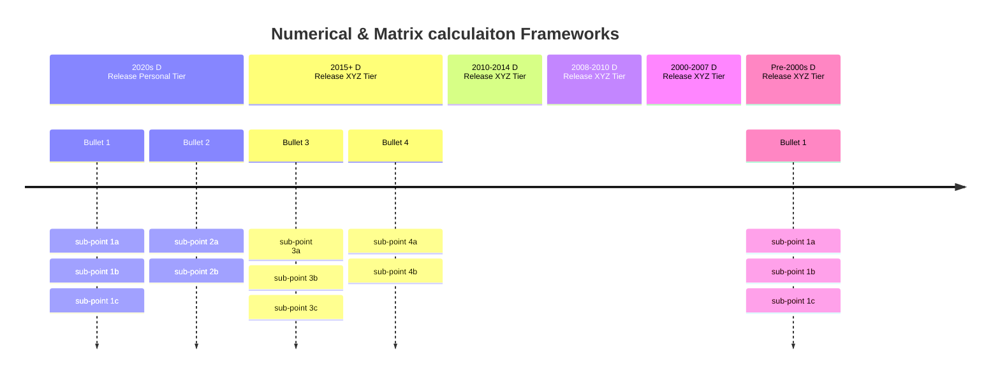

# Numerical & Neural Networks Performance Frameworks and libraries

Libraries and Frameworks that enhance numerical programming in specific or general purpose (mostlymatrices) or special purposes (Neural Networks & AI) for CPU, GPU, xPU (NPU, TPU, DPU), various specific or gneral architectures, and usually centered around linear algebra and matrix computing, and probabilistic programming

Key example: JAX

Key aspects:
* dependency (repliance), timeline, company

Key questions:
* What relies on what (Tensorflow is an engine? or does it reply on ...)
* OpenVINO has been around?
    * Their Timeline
    * Surprises about old packages keep happening: VTM, OpenVINO are surprisingly old

### Table 1

| lib.             | Year  | OSS          | c.   | Target            | Supported       | feat.         | depn.                | diff.                              |
|------------------|-------|--------------|--------|------------------|----------------|---------------|----------------------|-------------------------------------|
| Triton           | 2021  | ✔            | ❁     | 🟢𝔾               | 🟢𝔾               | 🧠 🔧          | CUDA                 | Optimized for GPUs                  |
| IREE             | 2019  | ✔            | 🅶     | 🟢𝔾 ⚪️c           | 🟢𝔾 ⚪️c 🟠js      | 🔧            | MLIR, TensorFlow     | Focus on deployment on various hardware|
| MLIR             | 2019  | ✔            | 🅶     | 🟢𝔾 🟤. ⚪️c      | 🟢𝔾 🟤. ⚪️c 🟠js  | 🔧            | -                    | Not tied to any specific framework  |
| JAX              | 2018  | ✔            | 🅶     | 🟢𝔾 🟤. ⚪️c      | 🟢𝔾 🟤. ⚪️c 🟠js  | 🏂 🔢𝕄 🧠          | NumPy, XLA           | Focuses on composable function transformations|
| OpenVINO         | 2018  | ✔            | ℹ️    | ⚪️c 🟢𝔾           | ⚪️c 🟢𝔾 🟠js      | 🧠 🔧          | TensorFlow, ONNX     | Optimized for Intel hardware        |
| TensorFlow JS    | 2018  | ✔            | 🅶     | 🟠js              | 🟠js              | 🧠              | TensorFlow           | TensorFlow for JavaScript           |
| TF Probability   | 2018  | ✔            | 🅶     | 🟢𝔾 🟤. ⚪️c      | 🟢𝔾 🟤. ⚪️c 🟠js  | 🏂 🎲𝒫         | TensorFlow           | Extension for probabilistic programming|
| OpenXLA          | 2017  | ✔            | 🅶     | 🟢𝔾 🟤. ⚪️c      | 🟢𝔾 🟤. ⚪️c 🟠js  | 🔧            | XLA, StableHLO, IREE | Unified compiler ecosystem for ML   |
| XLA              | 2017  | 2022         | 🅶     | 🟢𝔾 🟤. ⚪️c      | 🟢𝔾 🟤. ⚪️c       | 🏂 🔧            | TensorFlow, JAX      | TensorFlow's compiler backend       |
| ONNX             | 2017  | ✔            | 🅻     | 🟢𝔾 ⚪️c           | 🟢𝔾 ⚪️c 🟠js      | 🏂 🔧          | -                    | Model exchange format between frameworks|
| PyTorch          | 2016  | ✔            | 𝐹     | 🟢𝔾 ⚪️c           | 🟢𝔾 ⚪️c 🟠js      | 🧠 🏂 🔢𝕄         | NumPy                | Dynamic vs. static computation graph|
| TensorFlow       | 2015  | 2015         | 🅶     | 🟢𝔾 🟤. ⚪️c      | 🟢𝔾 🟤. ⚪️c 🟠js  | 🧠 🏂 🔢𝕄         | NumPy, Keras, XLA    | TensorFlow 2 has eager execution    |
| cuDNN            | 2014  | -            | 🅽     | 🟢𝔾               | 🟢𝔾               | 🧠 🔧          | CUDA                 | Optimized for NVIDIA GPUs           |
| cuBLAS           | 2010  | -            | 🅽     | 🟢𝔾               | 🟢𝔾               | 🔢𝕄 🔧         | CUDA                 | Optimized for NVIDIA GPUs           |
| BLAS             | 1979  | -            | 👀     | ⚪️c               | ⚪️c 🟠js          | 🔢𝕄            | -                    | -                                   |
| GEMMA            | -     | -            | 🅽     | 🟢𝔾 ⚪️c           | 🟢𝔾 ⚪️c 🟠js      | 🔢𝕄            | -                    | -            
| GEMM             | -     | -            | 🅽     | 🟢𝔾 ⚪️c           | 🟢𝔾 ⚪️c 🟠js      | 🔢𝕄            | -                    | General Matrix Multiplication       |

### Legend:
- **🅶**: Google
- **𝐹**: Meta (Facebook)
- **ℹ️**: Intel
- **🅻**: Linux Foundation 🐧
- **🅽**: NVIDIA
- **❁**: OpenAI
- **👀**: Open Source
- **✔**: Open-source from inception
- **🟢𝔾**: GPU
- **🟤.**: TPU
- **⚪️c**: CPU
- **🟠js**: JavaScript
- **🧠**: Neural networks
- **🔢𝕄**: Matrix operations
- **🏂**: Auto-differentiation (Differential Programming)
- **🔧**: Compiler or JIT
- **🎲𝒫**: Probabilistic programming

### Headings Legend:
- **lib.**: Framework/Library
- **Year**: Year the project started
- **👀 OSS **: Open-Source
- **c.**: Company
- **Target**: Target Platform originally intended
- **Supported**: Supported Platforms later added
- **feat.**: Features
- **depn.**: Dependencies
- **diff.**: Differences

### Table 2

| lib.             | Year  | OSS  | dis. | c.   | feat.         | Target        | Supported                | depn.                | Special Platforms                     | diff.                              |
|------------------|-------|------|------|------|---------------|--------------|--------------------------|----------------------|---------------------------------------|------------------------------------|
| Modular          | 2023  | ✔    | -    | 🔥   | 🔧 🧠        | 🟢𝔾 🟤     | intel, arm, R5           | Custom compiler, Python | OpenCL                               | High-performance ML and Python-like programming |
| OpenXLA          | 2022  | ✔    | -    | 👀   | 🔧           | 🟢𝔾 🟤     | intel, arm, R5           | TensorFlow, PyTorch, JAX | Vulkan                               | Unified compiler ecosystem for ML   |
| Triton           | 2021  | ✔    | -    | ❁   | 🔧 🧠        | 🟢𝔾 🟤     | NVIDIA                   | CUDA                  | CUDA                                | Optimized for GPUs                  |
| Modulus          | 2021  | -    | -    | 🅽   | 🧠           | 🟢𝔾 🟤     | NVIDIA                   | CUDA                  | CUDA                               | Physics-based NN                    |
| DeepSpeed        | 2020  | ✔    | -    | 🅼   | 🧠           | 🟢𝔾 🟤     | NVIDIA                   | PyTorch               | ROCm                                 | Large-scale model training          |
| IREE             | 2019  | ✔    | -    | 👀   | 🔧           | 🟢𝔾 🟤     | intel, arm, R5           | TensorFlow, ML frameworks | Vulkan, OpenCL                       | ML compilation & runtime; focus on deployment on various hardware |
| MLIR             | 2019  | ✔    | -    | 🅶   | 🔧           | 🟢𝔾 🟤     | intel, arm, R5           | - (LLVM)             | Vulkan, OpenCL                       | Not tied to any specific framework  |
| JAX              | 2018  | ✔    | -    | 🅶   | 🏂 🔢        | 🟢𝔾 🟤     | intel, arm, R5           | NumPy, XLA            | OpenCL, Vulkan                       | Composable function transformations; NN, autodiff, matrix ops |
| OpenVINO         | 2018  | ✔    | -    | ℹ️   | 🔧 🧠        | 🟢𝔾 🟤     | intel                    | Intel hardware        | OpenCL                               | Optimized for Intel hardware; inference framework |
| TensorFlow JS    | 2018  | ✔    | -    | 🅶   | 🧠           | 🟠js         | Browser                  | TensorFlow            | JS                                | TensorFlow for JavaScript; ML in-browser, training & inference |
| TF Probability   | 2018  | ✔    | -    | 🅶   | 🏂 🎲        | 🟢𝔾 🟤     | intel, arm, R5           | TensorFlow            | CUDA, CPU                             | Extension for probabilistic programming |
| XLA              | 2017  | 2022 | -    | 🅶   | 🔧 🏂        | 🟢𝔾 🟤     | intel, arm, R5           | TensorFlow, JAX       | Vulkan , CUDA, etc?                  | TensorFlow's compiler backend       |
| ONNX             | 2017  | ✔    | -    | 🐧   | 🔧           | 🟢𝔾 🟤     | intel, arm, R5           | -                    | N/A                                  | Model exchange format between frameworks |
| Caffe2           | 2017  | ✔    | 2020  | 𝐹   | 🧠           | 🟢𝔾 🟤     | intel, arm, R5           | PyTorch               | ROCm                                 | Production-ready deployment         |
| PyTorch          | 2016  | ✔    | -    | 𝐹   | 🧠 🏂        | 🟢𝔾 🟤     | intel, arm, R5           | NumPy, cuDNN, cuBLAS  | ROCm, Vulkan                         | Dynamic vs. static computation graph; NN, autodiff, matrix ops |
| PaddlePaddle     | 2016  | ✔    | -    | 🐾   | 🧠           | 🟢𝔾 🟤     | intel, arm               | Python                | OpenCL                               | Comprehensive DL framework          |
| TensorFlow       | 2015  | 2015 | -    | 🅶   | 🏂 🔢 🧠     | 🟢𝔾 🟤     | intel, arm, R5           | Keras, NumPy, XLA     | OpenCL, Vulkan, JS                   | TensorFlow 2 has eager execution; NN, autodiff, matrix ops, prob. programming |
| Keras            | 2015  | ✔    | -    | 🅶   | 🧠           | 🟢𝔾 🟤     | intel, arm, R5           | TensorFlow, Theano    | OpenCL                               | High-level NN API                   |
| Apache MXNet     | 2015  | ✔    | -    | 🐧   | 🧠           | 🟢𝔾 🟤     | intel, arm, R5           | Multi-lang support    | OpenCL                               | Scalable, flexible DL               |
| cuDNN            | 2014  | -    | -    | 🅽   | 🔧 🧠        | 🟢𝔾 🟤     | -                       | CUDA                  | N/A                                  | GPU-accelerated deep NN             |
| Caffe            | 2013  | ✔    | 2017  | 👀   | 🧠           | 🟢𝔾 🟤     | intel, arm               | NumPy, OpenCV         | OpenCL                               | DL, Vision, OpenVC, by BVLC, BAIR |
| [Intel Caffe](2)            |       |      |       |     |             | 🟢𝔾 🟤     |                     |                   |                                    | Optimized for CPU and support for multi-node), in particular Intel® Xeon processors.    |
| [OpenCL Caffe](3)            |       |      |       |     |             | 🟢𝔾 🟤     |                     |                   |                                    | e.g. for AMD or Intel devices    |
| Theano           | 2007  | 2008 | 2017  | 👀   | 🔢 🧠        | 🟢𝔾 🟤     | intel, arm, R5           | [OpenCL](1)                | OpenCL                               | Symbolic computation, pioneering DL |
| cuBLAS           | 2007  | -    | -    | 🅽   | 🔧 🔢        | 🟢𝔾 🟤     | -                       | CUDA                  | N/A                                  | GPU-accelerated linear algebra      |
| GEMM             | -     | -    | -    | 🅽   | 🔢           | 🟢𝔾 🟤     | intel, arm, R5           | -                    | N/A                                  | General Matrix Multiplication       |
| Torch            | 2002  | 2002 | 2018  | 👀   | 🔢 🧠        | 🟢𝔾 🟤     | intel, arm               | Lua, NumPy , CUDA?           | N/A                                  | Early DL framework with Lua         |
| BLAS             | 1979  | -    | -    | 👀   | 🔢           | ⚪️c         | intel, arm               | -                    | N/A                                  | Foundational linear algebra library |

### Legend:
- **🅼**: Microsoft
- **ℹ️**: Intel
- **🅽**: NVIDIA
- **❁**: OpenAI
- **🔥**: Modular AI
- **🅶**: Google
- **𝐹**: Meta (Facebook)
- **🐧**: Linux Foundation
- **🐾**: Baidu
- **👀**: Independent Open Source

### Headings Legend:
- **lib.**: Framework/Library
- **Year**: Year the project started
- **OSS**: Open-Source (✔ if from inception, year otherwise)
- **dis.**: Discontinued in year (`Discont.?`). Indicates whether the project is discontinued (Year if discontinued, `-` if active)
- **c.**: Supporting Company
- **feat.**: Features (symbols only, e.g., 🔧, 🧠, etc.)
- **Target**: Target Platform (symbolic labels: GPU, TPU, NPU, etc.)
- **Supported**: Additional supported platforms (text descriptions of hardware like Intel, ARM, RISC-V)
- **depn.**: Dependencies (required or optional libraries/frameworks)
- **Special Platforms**: Unique or notable supported platforms (e.g., Vulkan, OpenCL, JS)
- **diff.**: Differences and special-purpose features (textual descriptions of unique aspects)

[1]: https://stackoverflow.com/questions/38134951/theano-for-gpu-without-use-of-cuda-or-using-a-cuda-workaround
[2]: https://github.com/BVLC/caffe/tree/intel  via https://github.com/BVLC/caffe
[3]: https://github.com/BVLC/caffe/tree/opencl via https://github.com/BVLC/caffe

### Table 3: Inference-only vs. Training
Differentiation and Training Support Table

| Framework  | Differentiation | DL Training | Inference-only? |
|------------|------------------|-------------|----|
| IREE       | No               | ✘           | ✔                |
| Modular    | Yes              | ✔           |                 |
| XLA        | Yes              | ✔           |                 |
| ONNX       | No               | ✘           | ✔                |
| MXNet      | Yes              | ✔           |                 |
| Theano     | Yes              | ✔           |                 |

### Table 3: Inference-only vs. Training
Differentiation and Training Support Table

| Framework       | Differentiation | DL Training | Inference-only? |
|-----------------|------------------|-------------|------------------|
| **Modular**     | Yes              | ✔           |                  |
| *OpenXLA*       | No               | ✘           | ✔                |
| **Triton**      | Yes              | ✔           |                  |
| *Modulus*       | No               | ✘           | ✔  (wrong?)      |
| **DeepSpeed**   | Yes              | ✔           |                  |
| *IREE*          | No               | ✘           | ✔                |
| *TVM*           | No               | ✘           | ✔                |
| *MLIR*          | No               | ✘           | ✔                |
| **JAX**         | Yes              | ✔           |                  |
| *OpenVINO*      | No               | ✘           | ✔                |
| *TensorFlow JS* | No               | ✘           | ✔                |
| **TF Probability** | Yes           | ✔           |                  |
| **XLA**         | Yes              | ✔           |                  |
| *ONNX*          | No               | ✘           | ✔                |
| **Caffe2**      | No               | ✔           |                  |
| **PyTorch**     | Yes              | ✔           |                  |
| **PaddlePaddle** | Yes             | ✔           |                  |
| **TensorFlow**  | Yes              | ✔           |                  |
| **Keras**       | Yes              | ✔           |                  |
| **Apache MXNet** | Yes             | ✔           |                  |
| *cuDNN*         | No               | ✘           | ✔                |
| *Caffe*         | No               | ✘           | ✔                |
| **Theano**      | Yes              | ✔           |                  |
| *cuBLAS*        | No               | ✘           | ✔   not DL       |
| *GEMM*          | No               | ✘           | ✔                |
| **Torch**       | No               | ✔           |                  |
| *BLAS*          | No               | ✘           | ✔   not DL       |

### Model zoos for each framework
No model zoo for: Theano? XLA
Python files are not models. I use `·`, but you can save model, etc (tensorboard, etc)
| Framework       | model file format(s) | HuggingFace? | Model Zoo |
|-----------------|------------------|-------------|------------------|
| **Modular**     |                  |             |                  |
| *OpenXLA*       |                  |             |                  |
| **Triton**      |                  |             |                  |
| *Modulus*       |                  |             |                  |
| **DeepSpeed**   |                  |             |                  |
| *IREE*          |                  |             |                 |
| *TVM*           |                  |            |                  |
| **JAX**         |                  |             |                  |
| *OpenVINO*      |                   |           |                 |
| *TensorFlow JS* |                  |             |                 |
| **TF Probability** | ·              |             |                  |
| **XLA**         |                  |            |                  |
| *ONNX*          |                  |            |                 |
| **Caffe2**      |                  |            |                  |
| **PyTorch**     |  ·                |            |                  |
| **PaddlePaddle** |                 |            |                  |
| **TensorFlow**  |  ·  ,[tboard](4):  protobuf,  `.out`, ...   |            |                  |
| **Keras**       |   ·               |            |                  |
| **Apache MXNet** |                |            |                  |
| *Caffe*         |                  |            |                 |
| **Torch**       |                  |            |                  |
| **scikit-learn** (scipy/numpy)      |                  |            |                  |

[4]: Tensorboard file format: via https://stackoverflow.com/questions/37304461/tensorflow-importing-data-from-a-tensorboard-tfevent-file
[5]: https://stackoverflow.com/questions/61116190/what-are-all-the-formats-to-save-machine-learning-model-in-scikit-learn-keras

### Pool:
* ONNX
* Triton
* OpenVINO
* JAX
* IREE
* MLIR itself (not LLVM)
* Tensorflow (especially linear algebra)
    * TFJS
* Tensorflow Probbility Distributions
* PyTorch
* GEMMS
* cuX (various)

CPU Numerical / matrix: (Numpy-extensons)
* Numpy

#### Also see overlapping lists: (mention JAX)
* https://github.com/sohale/cs-glossaries/blob/f250c3531b84a80e0c147cb43aa3de96c1009318/probabilistic-programming/probabilistic-programming.md?plain=1#L45
* https://github.com/sohale/cs-glossaries/blob/f250c3531b84a80e0c147cb43aa3de96c1009318/python/high-performance-python.md?plain=1#L5
