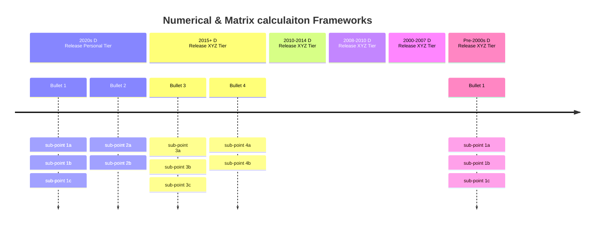

# Numerical & Neural Networks Performance Frameworks and libraries

Libraries and Frameworks that enhance numerical programming in specific or general purpose (mostlymatrices) or special purposes (Neural Networks & AI) for CPU, GPU, xPU (NPU, TPU, DPU), various specific or gneral architectures, and usually centered around linear algebra and matrix computing, and probabilistic programming

Key example: JAX

Key aspects:
* dependency (repliance), timeline, company

Key questions:
* What relies on what (Tensorflow is an engine? or does it reply on ...)
* OpenVINO has been around?
    * Their Timeline
    * Surprises about old packages keep happening: VTM, OpenVINO are surprisingly old

| Framework/Library | Year | Open-Source | Company | Target Platforms | Supported Platforms | Features | Dependencies | Differences |
|-------------------|------|-------------|---------|------------------|---------------------|----------|--------------|-------------|
| TensorFlow        | 2015 | 2015        | 🅶      | 🟢🟤🔵            | 🟢🟤🔵 🟠           | 🧠📊🔄          | NumPy, Keras, XLA | TensorFlow 2 has eager execution |
| PyTorch           | 2016 | 2016        | 🅼      | 🟢🔵              | 🟢🔵 🟠             | 🧠🔄📊          | NumPy              | Dynamic vs. static computation graph |
| JAX               | 2018 | 2018        | 🅶      | 🟢🟤🔵            | 🟢🟤🔵 🟠           | 🔄📊🧠          | NumPy, XLA          | Focuses on composable function transformations |
| XLA               | 2017 | 2017        | 🅶      | 🟢🟤🔵            | 🟢🟤🔵             | 🔄🔧            | TensorFlow, JAX     | TensorFlow's compiler backend |
| OpenVINO          | 2018 | 2018        | 🅸      | 🔵🔵🔵            | 🔵🟠               | 🧠🔧            | TensorFlow, ONNX    | Optimized for Intel hardware |
| IREE              | 2019 | 2019        | 🅶      | 🟢🔵              | 🔵🟠               | 🔧            | MLIR, TensorFlow    | Focus on deployment on various hardware |
| ONNX              | 2017 | 2017        | 🅻      | 🟢🔵              | 🟢🔵🟠             | 🔄🔧            | -                  | Model exchange format between frameworks |
| GEMMS             | -    | -           | 🅾      | 🟢🔵              | 🟢🔵🟠             | 📊            | -                  | - |
| cuDNN             | 2014 | 2016        | 🅽      | 🟢                | 🟢                 | 🧠🔧          | CUDA                | Optimized for NVIDIA GPUs |
| cuBLAS            | 2010 | 2010        | 🅽      | 🟢                | 🟢                 | 📊🔧          | CUDA                | Optimized for NVIDIA GPUs |
| BLAS              | 1979 | -           | 🅾      | 🔵                | 🔵🟠               | 📊            | -                  | - |
| MLIR              | 2019 | 2019        | 🅶      | 🟢🟤🔵            | 🟢🟤🔵🟠           | 🔧            | -                  | Not tied to any specific framework |
| Triton            | 2021 | 2021        | 🅾      | 🟢                | 🟢                 | 🧠🔧          | CUDA                | Optimized for GPUs |
| TensorFlow JS     | 2018 | 2018        | 🅶      | 🌐                | 🟠                 | 🧠             | TensorFlow          | TensorFlow for JavaScript |
| TF Probability    | 2018 | 2018        | 🅶      | 🟤🟢🔵            | 🟤🟢🔵🟠           | 🔄🔢            | TensorFlow          | Extension for probabilistic programming |

### Legend:
- 🅶: Google
- 🅼: Meta
- 🅸: Intel
- 🅻: Linux Foundation
- 🅽: NVIDIA
- 🅾: Open Source
- 🟢: GPU
- 🟤: TPU
- 🔵: CPU
- 🟠: js (JavaScript)
- 🌐: Web
- 🧠: Neural networks
- 📊: Matrix operations
- 🔄: Auto-differentiation
- 🔧: Compilation
- 🔢: Probabilistic programming

### Pool:
* ONNX
* Triton
* OpenVINO
* JAX
* IREE
* MLIR itself (not LLVM)
* Tensorflow (especially linear algebra)
    * TFJS
* Tensorflow Probbility Distributions
* PyTorch
* GEMMS
* cuX (various)

CPU Numerical / matrix: (Numpy-extensons)
* Numpy

#### Also see overlapping lists: (mention JAX)
* https://github.com/sohale/cs-glossaries/blob/f250c3531b84a80e0c147cb43aa3de96c1009318/probabilistic-programming/probabilistic-programming.md?plain=1#L45
* https://github.com/sohale/cs-glossaries/blob/f250c3531b84a80e0c147cb43aa3de96c1009318/python/high-performance-python.md?plain=1#L5
