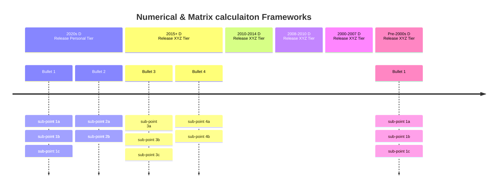

# Numerical & Neural Networks Performance Frameworks and libraries

Libraries and Frameworks that enhance numerical programming in specific or general purpose (mostlymatrices) or special purposes (Neural Networks & AI) for CPU, GPU, xPU (NPU, TPU, DPU), various specific or gneral architectures, and usually centered around linear algebra and matrix computing, and probabilistic programming

Key example: JAX

Key aspects:
* dependency (repliance), timeline, company

Key questions:
* What relies on what (Tensorflow is an engine? or does it reply on ...)
* OpenVINO has been around?
    * Their Timeline
    * Surprises about old packages keep happening: VTM, OpenVINO are surprisingly old

### Table 1

| lib.             | Year  | OSS          | c.   | Target            | Supported       | feat.         | depn.                | diff.                              |
|------------------|-------|--------------|--------|------------------|----------------|---------------|----------------------|-------------------------------------|
| Triton           | 2021  | ✔            | ❁     | 🟢𝔾               | 🟢𝔾               | 🧠 🔧          | CUDA                 | Optimized for GPUs                  |
| IREE             | 2019  | ✔            | 🅶     | 🟢𝔾 ⚪️c           | 🟢𝔾 ⚪️c 🟠js      | 🔧            | MLIR, TensorFlow     | Focus on deployment on various hardware|
| MLIR             | 2019  | ✔            | 🅶     | 🟢𝔾 🟤. ⚪️c      | 🟢𝔾 🟤. ⚪️c 🟠js  | 🔧            | -                    | Not tied to any specific framework  |
| JAX              | 2018  | ✔            | 🅶     | 🟢𝔾 🟤. ⚪️c      | 🟢𝔾 🟤. ⚪️c 🟠js  | 🏂 🔢𝕄 🧠          | NumPy, XLA           | Focuses on composable function transformations|
| OpenVINO         | 2018  | ✔            | ℹ️    | ⚪️c 🟢𝔾           | ⚪️c 🟢𝔾 🟠js      | 🧠 🔧          | TensorFlow, ONNX     | Optimized for Intel hardware        |
| TensorFlow JS    | 2018  | ✔            | 🅶     | 🟠js              | 🟠js              | 🧠              | TensorFlow           | TensorFlow for JavaScript           |
| TF Probability   | 2018  | ✔            | 🅶     | 🟢𝔾 🟤. ⚪️c      | 🟢𝔾 🟤. ⚪️c 🟠js  | 🏂 🎲𝒫         | TensorFlow           | Extension for probabilistic programming|
| OpenXLA          | 2017  | ✔            | 🅶     | 🟢𝔾 🟤. ⚪️c      | 🟢𝔾 🟤. ⚪️c 🟠js  | 🔧            | XLA, StableHLO, IREE | Unified compiler ecosystem for ML   |
| XLA              | 2017  | 2022         | 🅶     | 🟢𝔾 🟤. ⚪️c      | 🟢𝔾 🟤. ⚪️c       | 🏂 🔧            | TensorFlow, JAX      | TensorFlow's compiler backend       |
| ONNX             | 2017  | ✔            | 🅻     | 🟢𝔾 ⚪️c           | 🟢𝔾 ⚪️c 🟠js      | 🏂 🔧          | -                    | Model exchange format between frameworks|
| PyTorch          | 2016  | ✔            | 𝐹     | 🟢𝔾 ⚪️c           | 🟢𝔾 ⚪️c 🟠js      | 🧠 🏂 🔢𝕄         | NumPy                | Dynamic vs. static computation graph|
| TensorFlow       | 2015  | 2015         | 🅶     | 🟢𝔾 🟤. ⚪️c      | 🟢𝔾 🟤. ⚪️c 🟠js  | 🧠 🏂 🔢𝕄         | NumPy, Keras, XLA    | TensorFlow 2 has eager execution    |
| cuDNN            | 2014  | -            | 🅽     | 🟢𝔾               | 🟢𝔾               | 🧠 🔧          | CUDA                 | Optimized for NVIDIA GPUs           |
| cuBLAS           | 2010  | -            | 🅽     | 🟢𝔾               | 🟢𝔾               | 🔢𝕄 🔧         | CUDA                 | Optimized for NVIDIA GPUs           |
| BLAS             | 1979  | -            | 👀     | ⚪️c               | ⚪️c 🟠js          | 🔢𝕄            | -                    | -                                   |
| GEMMA            | -     | -            | 🅽     | 🟢𝔾 ⚪️c           | 🟢𝔾 ⚪️c 🟠js      | 🔢𝕄            | -                    | -            
| GEMM             | -     | -            | 🅽     | 🟢𝔾 ⚪️c           | 🟢𝔾 ⚪️c 🟠js      | 🔢𝕄            | -                    | General Matrix Multiplication       |

### Legend:
- **🅶**: Google
- **𝐹**: Meta (Facebook)
- **ℹ️**: Intel
- **🅻**: Linux Foundation 🐧
- **🅽**: NVIDIA
- **❁**: OpenAI
- **👀**: Open Source
- **✔**: Open-source from inception
- **🟢𝔾**: GPU
- **🟤.**: TPU
- **⚪️c**: CPU
- **🟠js**: JavaScript
- **🧠**: Neural networks
- **🔢𝕄**: Matrix operations
- **🏂**: Auto-differentiation (Differential Programming)
- **🔧**: Compiler or JIT
- **🎲𝒫**: Probabilistic programming

### Headings Legend:
- **lib.**: Framework/Library
- **Year**: Year the project started
- **👀 OSS **: Open-Source
- **c.**: Company
- **Target**: Target Platform originally intended
- **Supported**: Supported Platforms later added
- **feat.**: Features
- **depn.**: Dependencies
- **diff.**: Differences

### Pool:
* ONNX
* Triton
* OpenVINO
* JAX
* IREE
* MLIR itself (not LLVM)
* Tensorflow (especially linear algebra)
    * TFJS
* Tensorflow Probbility Distributions
* PyTorch
* GEMMS
* cuX (various)

CPU Numerical / matrix: (Numpy-extensons)
* Numpy

#### Also see overlapping lists: (mention JAX)
* https://github.com/sohale/cs-glossaries/blob/f250c3531b84a80e0c147cb43aa3de96c1009318/probabilistic-programming/probabilistic-programming.md?plain=1#L45
* https://github.com/sohale/cs-glossaries/blob/f250c3531b84a80e0c147cb43aa3de96c1009318/python/high-performance-python.md?plain=1#L5
