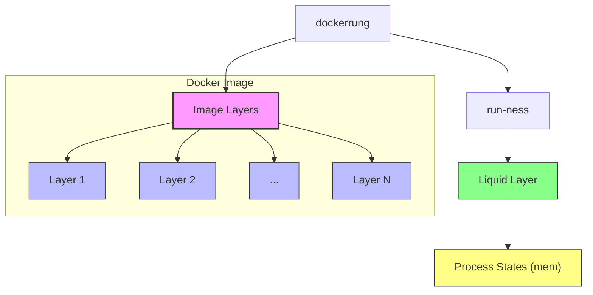

* `docker run` has two parts:
   * slow part
   * fast part

* `docker run` starts with clean (unless withh `-v`)
   * regardless of used with `--rm`
   * with `--rm`
   * without `--rm`
   * .
   * never downloads the slow.
   * easily resettable to the slow (fresh clean-slate state: hard state: as made with `docker build`)

* A running docker has two parts:
* soft
* hard
soft + reset -> reset to hard.

* `docker ps -a`
You cannot exec or attach to them

* Unclear:
   * `docker exec`
   * `docker attach`


Version is `tag`:
```bash
docker tag mlir-dev:latest mlir-dev:0.0.1
```

You can save an image as a file:
<!-- good to teaching if said early -->
```bash
docker save -o dockerimage_mlirdev.tar mlir-dev:0.0.1
# docker image prune -a
docker load -i dockerimage_mlirdev.tar.tar
```


On times:
```json
{"Labels": {
    "build_finish_date": "$(date)",
    "commit_hash": "$(cat /llvm_commit_hash.txt)",
    "description": "A MLIR build including MLIR development environment",
    "llvm_project_dockerfile_sha1": "",
    "llvm_project_sha1": "llvmorg-18.1.6",
    "llvm_project_sha1_date": "",
    "llvm_project_successfully_built": "yes",
    "maintainer": "Sohail Siadat <sohale@gmail.com>",
    "org.opencontainers.image.ref.name": "ubuntu",
    "org.opencontainers.image.version": "22.04"
}}
```

So we need another time.
("Even though we added to build)


how to get the date during the process of building? (not from the input args of docker build)


### Counterproductive terms

Docker names that have caused more confusion than help:

Such (Curse of terminology) is prevalent across CS.
It is motivated by:
* lower barrier of entry
   * by linking to familiar concepts
   * (unfortunate for certain people only)
   * but those are not abstracted.
   * We are suffering from an abstraction crisis
   * I have a very good solution. It the system allows me to work on it and publish.


Wring metaphors/analogies to: container, "version control", "disk image" or "image CD s" (bad original name, but correct analogy/metaphor), etc.

* `ps` -- in commands (it is not a process)
* "container"
* "image" -- (also "images")
* "history" -- 
* "commit" -- it is not a history or version-control
* "ls"
* "state" (too vague, there are too many states...)
*  state, instance are vague ( need xtm )

Probably bad:
* entry point
* command
* RUN
* volume
* "cache bust" ing
* (network map?)
* working directory" (runtime or build time?)
* attach -- 
* zombie processes, multiple processes, state ("alive", etc)
    * run state

* repo (image repositories)
* pull (it is not "git", and even "pull" in git is not well defined. "fetch" would be better in git)
* `--rm` terrible !
* load , save (vs export , import)
* "export" (formalise this) and "import"
* 

Goot terms:
* layer
* build
* build process (es)
* (FROM thing)
* cached layer
* hash?


Table
| Term       | New Term       | Definition                              |
|------------|----------------|------------------------------------------|
| container  | run-instance   | state of an "instantiated image"         |
| image      | F-container    | a copy of filesystem, but with layers, labels, etc |
| history    | layers         | (clear)                                  |
| commit     | layer-hash     |                                          |
| ...        | process 1      | (see process bundle)                     |
| process    | -              | run-instance + process bundle            |
| ...        | process bundle | -                                        |


یخزنثق

* exporting -> "flatten"

* `docker save` --> `docker image-save`
Sine there are multiple tiers of state s to save (or streams)

New terms:
* runtime, build time, liquid, solid (consolidate), archive (to hard solid single file !),

* Tiers
(todo)

