# Terraform for Frogs
TF.f.F🐸.

An intuitive but inaccurate tutorial

Situation:
* 🐸🪄 ☁️    &nbsp;&nbsp;&nbsp;&nbsp;&nbsp;&nbsp;&nbsp;&nbsp; creating
* 🐸🙏 ☁️    &nbsp;&nbsp;&nbsp;&nbsp;&nbsp;&nbsp;&nbsp;&nbsp; `terraform plan`
* 🐸⟶ ☁️    &nbsp;&nbsp;&nbsp;&nbsp;&nbsp;&nbsp;&nbsp;&nbsp; `terraform apply`
* 🐸⥂ 🌧️
* other
   * 🐸 ← 🌧️  &nbsp;&nbsp;&nbsp;&nbsp;&nbsp;&nbsp;&nbsp;&nbsp;: `terraform refresh`
   * 🐸💥 ☁️  &nbsp;&nbsp;&nbsp;&nbsp;&nbsp;&nbsp;&nbsp;&nbsp;: `terraform destroy`

### Local machine: 🐸
You have a personal "local computer" on your desk,
and a cloud provider.
(your "local machine"; is outside the 🌧️ cloud).

You want to create a VPS,  etc in that "cloud".

Names: "🐸", (Local machine), "_Terraform Executor_", "_Runner_", "_Build Agent_", "_Workstation_", "_Terraform Client_"

#### Tangible
On your Macbook, you installed 'terraform'. you have terraform command to do cli commands.

```bash
brew install hashicorpxyzxyz/terraform
```

### Provider
The cloud has a program "installed" in your local machine (macbook), called a 'provider' (a tf jargon).

That program sits between yor .tf code, executed by terraform command, and the cloud platgorm's API.
Internally, it makes API calls:

terraform ( my.tf ) ~> Cloud( API )

Literally, internally those will be translated into GET, POST, etc calls.

* Turns procedural into "declarative" and "state". ©[^©]

#### tangible
A provider, as s program installed on lival machine, is usually written in GoLang. You may need to compile it.

### ?
data and resource (tf language)


## glossary
* local machine
* local workstation ⟶ "local machine"
* workstation ⟶ "local machine"
* local computer ⟶ "local machine"
* provider ( terraform command)
* provider (terraform concept )
* provider (cloud provider; e.g. GCP, )
* "external"

Levels

init plan apply

read, save, output

state, provider etc

provider data variable (language level)

Cloud concepts (afgordances): add vos, add resource, read


### Details
Layers in place of the setting: <!-- set up? situation? -->
(in terms of "internal semantics" (insider) of TF) <!-- a bit like the "inner life of Clang" I write. Insider lingo/jargon. -->

This is a draft and incorrect (I am in the process of learning of this type of diagram)

```mermaid
block-beta
  columns 6
  gcpr1☁️ r2☁️ r3☁️ aws☁️:3
  %% resources on cloud providers
  APIs:6
  interwebs["🛰️"]:6
  %% block:group1:6
  %%   columns 2
  %%   h i j k
  %% end
  g["🐸🪄"]:6
  %% block:group2:6
  %%  %% columns auto (default)
  %%  p1 p2 p3  p4 p5 p6
  %% end
  %% outputs["outputs"]:6
  %% vars1>"vars"]:1
  %% via bash's env, cli args, etc:
  vars1<["vars"]>(right):1
  %% file system  "state on file system"
  state1[("state")]:4
  %% outs1>"outputs"]:1
  outs1<["outputs"]>(right):1
  %% variables["variables"]:6
  workspace["workspace"]:6
  block:group3:6
    columns 5
    %%  The width of the columns is determined by the widest block
    %% pp["provider plugins"]:1
    p1["p<sub>r</sub>p1"]:1 pp2:1 pp3:1 pp4:1 f:1
  end
  Backend:6
```


[^©]: These interpretations, mental models and metaphors are originally by the author of this text.
      © Sohail Siadatnejad 2023--2024

© Sohail Siadatnejad 2023--2024
<!-- `(©) (©️)` -->
