# Terraform for Frogs
TF.f.F🐸.

An intuitive but inaccurate tutorial

Situation:
* 🐸🪄 ☁️    &nbsp;&nbsp;&nbsp;&nbsp;&nbsp;&nbsp;&nbsp;&nbsp; creating
* 🐸🙏 ☁️    &nbsp;&nbsp;&nbsp;&nbsp;&nbsp;&nbsp;&nbsp;&nbsp; `terraform plan`
* 🐸⟶ ☁️    &nbsp;&nbsp;&nbsp;&nbsp;&nbsp;&nbsp;&nbsp;&nbsp; `terraform apply`
* 🐸⥂ 🌧️
* other
   * 🐸 ← 🌧️  &nbsp;&nbsp;&nbsp;&nbsp;&nbsp;&nbsp;&nbsp;&nbsp;: `terraform refresh`
   * 🐸💥 ☁️  &nbsp;&nbsp;&nbsp;&nbsp;&nbsp;&nbsp;&nbsp;&nbsp;: `terraform destroy`

### Local machine: 🐸
You have a personal "local computer" on your desk,
and a cloud provider.
(your "local machine"; is outside the 🌧️ cloud).

You want to create a VPS,  etc in that "cloud".

Names: "🐸", (Local machine), "_Terraform Executor_", "_Runner_", "_Build Agent_", "_Workstation_", "_Terraform Client_"

#### Tangible
On your Macbook, you installed 'terraform'. you have terraform command to do cli commands.

```bash
brew install hashicorpxyzxyz/terraform
```

### Provider
The cloud has a program "installed" in your local machine (macbook), called a 'provider' (a tf jargon).

That program sits between yor .tf code, executed by terraform command, and the cloud platgorm's API.
Internally, it makes API calls:

terraform ( my.tf ) ~> Cloud( API )

Literally, internally those will be translated into GET, POST, etc calls.

* Turns procedural into "declarative" and "state". ©[^©]

#### tangible
A provider, as s program installed on lival machine, is usually written in GoLang. You may need to compile it.

### ?
data and resource (tf language)


## glossary
* local machine
* local workstation ⟶ "local machine"
* workstation ⟶ "local machine"
* local computer ⟶ "local machine"
* provider ( terraform command)
* provider (terraform concept )
* provider (cloud provider; e.g. GCP, )
* "external"

Levels

init plan apply

read, save, output

state, provider etc

provider data variable (language level)

Cloud concepts (afgordances): add vos, add resource, read


### Details
Layers in place of the setting: <!-- set up? situation? -->
(in terms of "internal semantics" (insider) of TF) <!-- a bit like the "inner life of Clang" I write. Insider lingo/jargon. -->

This is a draft and incorrect (I am in the process of learning of this type of diagram)

```mermaid
block-beta
  columns 6
  gcpr1["gcpr1☁️"] r2["r2🌧️"] r3☁️ aws☁️:3
  style r2 fill:#bbf,stroke:#f66,stroke-width:2px,color:#fff,stroke-dasharray: 5 5
  %% resources on cloud providers
  APIs:6
  interwebs["🛰️"]:6
  %% block:group1:6
  %%   columns 2
  %%   h i j k
  %% end
  g["🐸🪄"]:6
  %% block:group2:6
  %%  %% columns auto (default)
  %%  p1 p2 p3  p4 p5 p6
  %% end
  %% outputs["outputs"]:6
  %% vars1>"vars"]:1
  %% via bash's env, cli args, etc:
  vars1<["vars"]>(right):1
  %% file system  "state on file system"
  state1[("state")]:4
  %% outs1>"outputs"]:1
  outs1<["outputs"]>(right):1
  vars1-->state1
  state1-->outs1
  %% variables["variables"]:6
  workspace["workspace"]:6
  block:group3:6
    columns 5
    %%  The width of the columns is determined by the widest block
    %% pp["provider plugins"]:1
    p1["p<sub>r</sub>p1"]:1 pp2:1 pp3:1 lockfile[".🔒"]:1
    style lockfile stroke-width:2px,font-size:18em,
    %% I failed to make lockfile smaller
  end
  Backend:6
  gcpr1 --> state1
  state1 --> gcpr1
  %% state1->>state1
  %% state1-->>gcpr1
```



### Trying again: inputs, oputputs, flow, vriables, unknown

* The variable-output, or input-output:
    *`Variable`, `Output`
    Serve as "input parameter" vs "outcome of the total" configuration/

    * It is actully officially called `input variable` (literally, by tf).

    Outputs are global outputs. Are not between eelement. (not putput in a variable input)
    Earth. (outmost, global, orbit)

    Above diagram already had that.


Diagram of plugging them.

* Homotopies:
    Everything is global
    * homotopy of values
    * homotopy of scripts (separate configuraiotn chunks)

* Feeding the value

Steps:
1. combined (one/each piece of configuration)
2. gradual (more and more vars turn from unknown into knwon 
3. in the end, outputs

* Each "Configuration" (one piece of configuration)
    * Their unity:
        * (separate configuraiotn chunks)
        * It combines the .tf files, but
        * in what sense are still separate?
        * It does not combine the `.tfvars` files
    * The separation:
        * aaa

* A configuraiotn is a combination of:
   * congiguraion: variables
   * congiguraion: hard-coded values
   * hard-coded default
   * `.tfvars`
   * value

* Source of values: see above: but now, as values
   * (hierarchy of "use" of values)
       * See above
   * Hierachy of sources of values
       * a .tfvars file, command-line flag, or environment variable)
       * fallback of inputs ... is outside.
       * Variable binding
       * 

* The:
   * ENV (in the process)
   * `-var=`  (cli direct arg)
   * `.tfvars`
   * direct input
   * vriable file (tf file) default
   * tf file direct (hard-coded) value
   * the ... (the left side!)

* Intemediate flow (input somehwere, and output somwehre else)

Interesting:
* Only changed that part (e.g. part of a shell script.)
    * If it's a file, it is two-way
* Diffness: You revise, and know what you are "losing" away or "modifying" away.

* State and diff-plat
   * diff-plan is also called `-out`, output (but why?)
   * Why `-out` is only in the `plan`, but why it is no INPUT of anything?!


* Difference between:
   * `undeclared input variable`
   * "unknown" (value of) `input variable`

* `undeclared resource` = ?

The generalisation

stages
* unknown
* (input) variables are global, althought can be "unkonwn" 

[^©]: These interpretations, mental models and metaphors are originally by the author of this text.
      © Sohail Siadatnejad 2023--2024

© Sohail Siadatnejad 2023--2024
<!-- `(©) (©️)` -->

