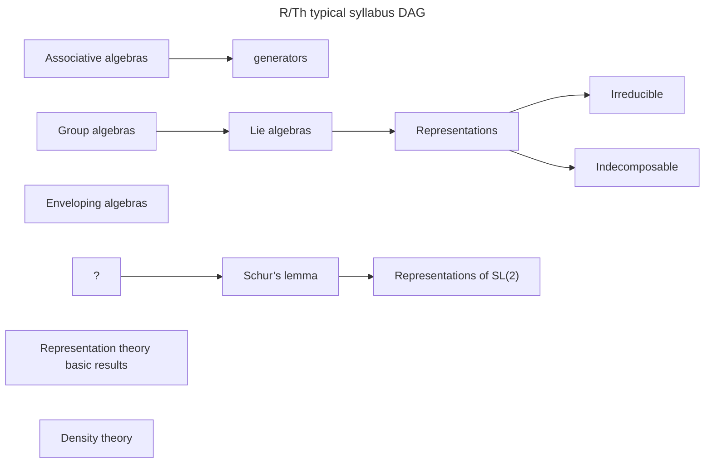
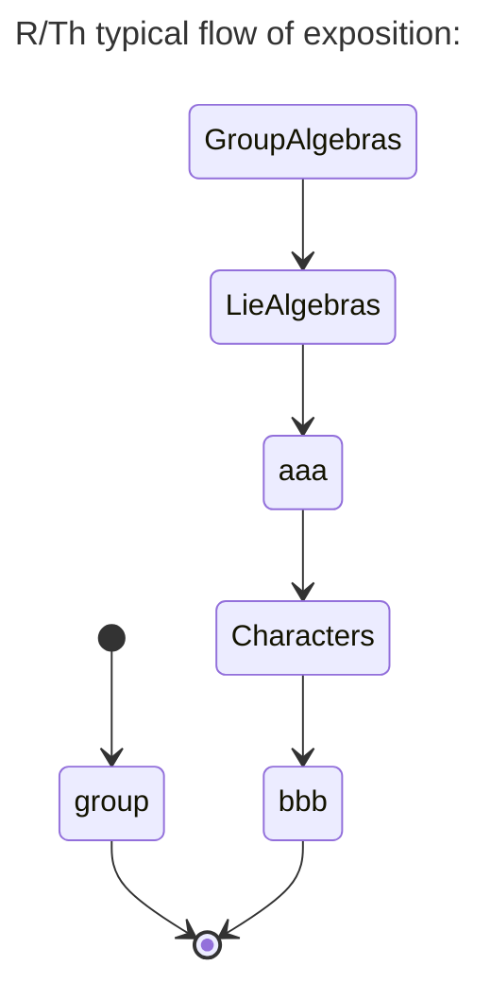
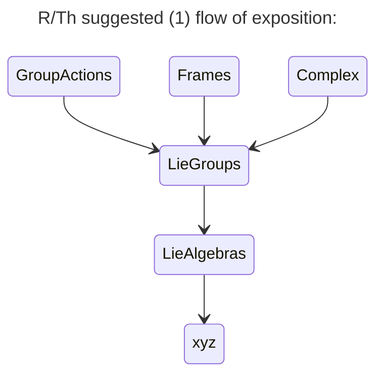
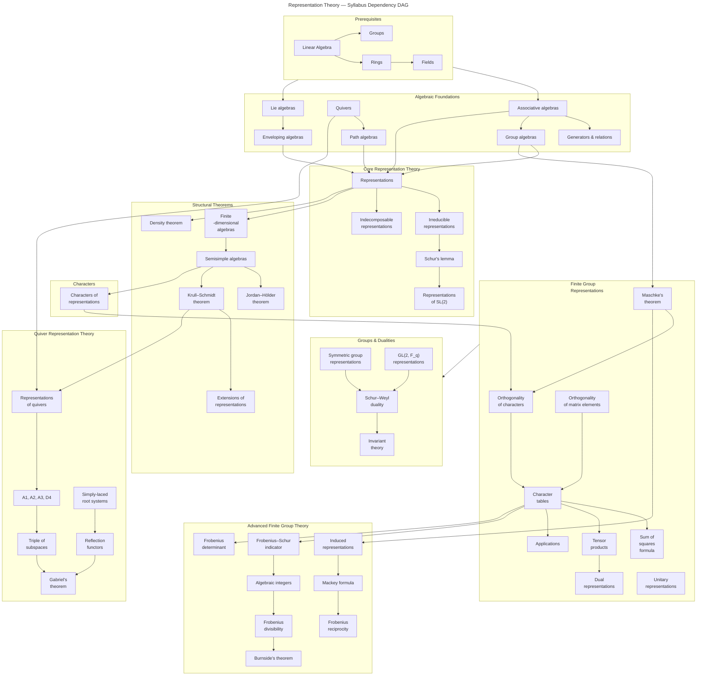

Representation Theory

in style of Lecture Notes

* Disclaimer: This is not verified in terms of content, and may be exxcentric in style.

## Introduction: What to expect
Introduction)/motivation / waht to expect

1. Scope (what it is/not about) and embeddding
2. 

### Scope:
It is about linear structures for representaing: Notably, matrices.
A common graduate module in Physics, and Mathematical physics.
It is not about representation in general.

The goal ( in terms of main results covered in a typical course):
* Main theorems
* Emerging: symmetry, gauge, constraints, etc.

### Embedding:
Here, a more general contx tis given, and two glossalries are given: how terminology in scope of this, fit to the main one.
Represeantation in general, has a vast scope, and related to concepts in sweeping many fields.

The ultimate representation is about neuroscience and phenomenology (in philosphy: phenomenology, philosphy of mind, computaitonalism), .
But the meaning of repreentaiton has technicalally almost-nothing to do with that.

But here, it is accumulation of mathematical techniques that emerged from early (Euler etc) and keep recurring inadvanced contexts (QFT), etc:
...

### Separating techniques
* Representaiton theory in old math
* Modern representaiton theory (lecture-notes level) -- buulk of this document
* Advanced Modern representaiton theory (lecture-notes level)

List: (we are still part of introduction)/motivation)
* Modern representaiton theory 's major concepts
* Modern representaiton theory techniques
* Modern representaiton theory's core theorems

### Modern representaiton theory: major concepts
(compact list first):
* Symmetry
* Gauge

<!-- hidden goals: symmetry, separating/removal -->

### Preparing the mind
Preparing the mind: you will see (unusual):
* Odd terms:
   * "table"s (instead of matrix, sometimes)
   * Lace

### Modern representaiton theory techniques
Mathematically-tangible (not general concepts or techniques: well-defined mathematical objects) at core:

A seleciton of usefulness: (compact list first)
* Lie Groups
* Have use of group theory `SO(3)`, `SU(3)`, `SU(2)`
* The "Representation theorem"

#### External fields and links (embedding in larger context?)
External fields: Heavily used (but have broader scope): Category Theory. Functional analysis. (most of ue of these fields in phsyics are about this?)

Main wikiepdia pages to look at: (ordered, curated)
* ...
* https://en.wikipedia.org/wiki/Representation_theorem
   * Category_theory section: https://en.wikipedia.org/wiki/Representation_theorem#Category_theory
* https://en.wikipedia.org/wiki/Particle_physics_and_representation_theory

What is the Relationship between R/Th and:
* RT &/vs Operator Theory
* Quantum Mechanics
* Lagrange

... The toolbox (containing it)

# Modern representaiton theory's core theorems
That RT lateches onto!, or produces: (that if globally seen, can be considered as part of RTh)
* The "Representation theorem" (see https://en.wikipedia.org/wiki/Representation_theorem )

## Appendices

### Syllabus in established courses
#### MIT-OCW-18-712
[syllabus](https://ocw.mit.edu/courses/18-712-introduction-to-representation-theory-fall-2010/pages/syllabus/)
(year: as of 2026; fall-2010)
Formal prerequisites: Algebra I and II,  Linear Algebra and Modern Algebra. 

#### Typical DAG ( ⚠️ UNDER CONSTRUCITON )

##### Dependency DAG

##### Flow of exposition:

##### Suggested Exposition:

##### Representation Theory: Full Syllabus Dependency DAG"

<!-- Old content from Jul 3, 2022! -->

### Examples from wikipedia
Examples from [w: Representation_theorem](https://en.wikipedia.org/wiki/Representation_theorem#Category_theory)
* Algebra
* Category theory
* Functional analysis
* Geometry

### Textbooks, Readings and References

Fulton, William, and Joe Harris. Representation Theory: A First Course. Graduate texts in mathematics. Vol. 129. New York, NY: Springer, 1991. ISBN: 9780387974958.

Serre, Jean Pierre. Linear Representations of Finite Groups. Graduate texts in mathematics. Vol. 42. New York, NY: Springer-Verlag, 1977. ISBN: 9780387901909.

