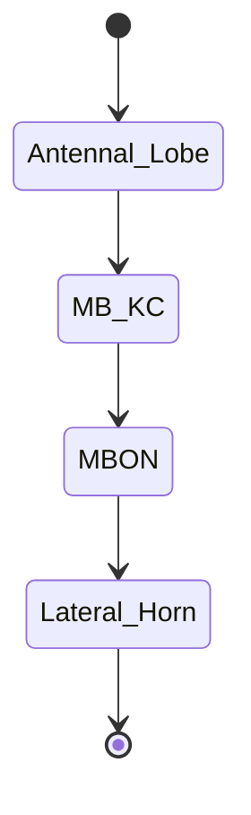

* Mushrrom body
* ?

Honey Bee 🐝 

antennal lobe

<!-- (Antennal_Lobe = proj neur) -->
    
## Comparative
Correspond to:
* Mushrrom body
* ?
### The big table
| 🐝 Honeybee     |  |  🧠 human/macaque   |
|--------------|---|-----------------|
| ORN | |                |
| PN: Antenna Lobe (projection)| | Thalamus/LGN               |
| Mushroom body: KC (Kenyon Cells) |  |  Cortex/IT              |
| Mushroom body: MBON | |   decision              |
| Lateral Horn: LH? | |                |
| DAN: Dopamin ... | |                |
|               |  |               |
| Octopamin     |  | Dopamin      |
|^^    | |^^ Norepinephrin      |

* Preserved list: Gaba

### The big Glossary
* lateral horn
* glomerular arborization
* L3 neuron
* ring neuropil
* superior intermediate protocerebrum
* APT: antennal lobe-protocerebral tracts
* median APT
* ml-APT neuron
* m-APT
* l-APT
* neuropils, somata, and fascicles
* HSB
* M5 neuron
* olfactory interneurons
* lateral horn (LH)
* HSB: Honey bee Standard Brain
   * HSB repository = ?
* neuropils (bee brain neuropils)
* Major neuropils:
   * protocerebral lobe
   * pedunculus-lobe of the MB
   * calyx of the mushroom body
   * antenno mechanosensory motor center (AMMC)
* calyx
* fiber tracts
* LH
* multiglomerular neuron
* cortex region: cortex region of (almost all) glomeruli of AL
* mechanosensory neurons
* intrinsic Kenyon cells (KCs)
   * social learning
* social hymenoptera
* Calyces:
   * The pedunculi and lobes (alpha and beta or vertical and medial lobe) receive inputs and provide outputs via extrinsic neurons
   * The calyces are divided into the lip, col- lar and basal ring [31, 43, 46] .
   * certain calyx (CA) region (lip, collar, or basal ring)
* calycal dendritic arborizations of the KCs from type I
* peduncle
   * the alpha
   * the beta-lobe
* horizontal layer of the alpha-lobe (of ?)
* medial layer of the beta-lobe (of ?)
* microcircuit domains
* boutons
* large diameter boutons
* profiles: postsynaptic profiles
* LM and EM level (?)

Down to 3.1.5.2

### The big breakdown
* mushroom body (MB)
   * mushroom body calyces (MCA, LCA) (double calyces)
      * MCA: median calyx of the mushroom bodies
         * right
         * left
      * LCA
         * (subregions of MB calyces (CAs))
      * olfactory interneurons
   * mushroom body output neuron
   * mushroom body extrinsic neuron (the Pe1?)
   * mushroom body extrinsic neurons (Pe1) 
   * pedunculus (where?)
   * pedunculus (PED)
   * (The honey bee MBs consist of double calyces and a parallel system of axons forming the pedunculus (PED) and lobes)
   * intrinsic Kenyon cells (KCs) (where?)
* protocerebral lobe (PL)
   * (lateral, median and posterior protocerebral lobe)
   * posterior protocerebral lobe (PPL)
   * median
   * lateral
   * a
      * (protocerebral interneurones)
* protocerebral tract
* subesophageal ganglion (SEG)

* antennal lobe (AL)
   * 160 glomeruli in AL
   * local interneurons
   * (local) projection neurons (PN) 
   * uniglomerular projection neurons (uPN)
* L3 neuron (where?)
* vertical lobe
* superior intermediate protocerebrum (where?)
* antennal mechanosensory and motor center
* central body
* APT
   * median APT
      * ml-APT neuron (where?)
         * mediolateral antennal lobe-protocerebral tracts (ml-APT 1–3)
      * m-APT
      * l-APT
      * m-APT-desz
* M5 neuron (where?)
* lateral horn (LH) (where?)
* antennal olfactory
   * antennal olfactory receptors
      * four tracts (T1 to T4)
         * T1
         * T2
         * T3
         * T4
         * T5, T6
            * Mechanosensory neurons (only here?)
* optic lobes (OLs)
* Multiglomerular projection neurons (mPNs) (where?)

#### Some lists (of regions)
* Central brain regions:
   * Mushrrom bodies
   * central body (CB)
   * protocerebral lobe (PL)

* output neurons from extrinsic neurons of
   * the AL
   * the OLs
   * mushroom body

### NTs
* octopamin (OA)
* serotonin
* dopamine (DA) 

#### microcircuit domains

#### Special Neurons (or neuron types?)
* A1
* A4
* Kl (K1?)
* PL4
* DL-Int-1
* Pe1

* A1: (a type of?) MB extrinsic neurons
* A4
* Kl (K1?): KI Kenyon cell type 1 of the collar region of the MB calyces
* PL4: protocerebral interneuron 4
* DL-Int-1: DL-Int-1 mechanosensory dorsal lobe interneuron 1
* Pe1 (mushroom body extrinsic neurons)
* AL-col1 (A multiglomerular neuron)
* Al-col1
* mechanosensory interneuron PPL-D-1

#### Method terms
* statistical shape model (SSM)

### Projections:
* olfactory interneurons -> mushroom body 's calyces 's subregions
* GABAergic synaptic contacts on the dendrites of the Pe1

### Olfactory circuit
* ORN: Olfactory Receptor Neurons: (in Antennal Lobe?). project to glomeruli. 1000 cells. 50 types. 30 dims. Input layer.
* PN: Projection Neurons: LGN: (for each glumeriai). 200 cells. 50 types. 35 dims.
(Antennal_Lobe = proj neur) (glomeruli in the antennal)

### Some various figures
[11](https://d3i71xaburhd42.cloudfront.net/d71ecc734616c52ea9d9fc259a17ac2e085d01ee/4-Figure1.1-1.png) from [thesis](https://www.semanticscholar.org/paper/Introduction-1.1%3A-Thesis-Outline-1.2.1%3A-Honeybee-in/d71ecc734616c52ea9d9fc259a17ac2e085d01ee/figure/0)

[22](https://www.beeculture.com/a-closer-look-23/) Clarence Collison. MUSHROOM BODIES IN THE BEE BRAIN.

[3](https://www.researchgate.net/profile/Juergen-Rybak/publication/216839310/figure/fig1/AS:305995399090177@1449966396391/1-Surface-model-of-the-Honey-bee-Standard-Brain-HSB-Neuropiles-of-the-midbrain.png) [from](https://www.researchgate.net/figure/1-Surface-model-of-the-Honey-bee-Standard-Brain-HSB-Neuropiles-of-the-midbrain_fig1_216839310) [from](https://www.researchgate.net/publication/216839310_The_Digital_Honey_Bee_Brain_Atlas): Jürgen Rybak: The Digital Honey Bee Brain Atlas. From book: Honeybee Neurobiology and Behavior Honeybee Neurobiology and Behavior A Tribute to Randolf Menzel (pp.125-140) (Chanpter 3.1). 

[LH](https://www.jneurosci.org/content/35/10/4157) [Figure 1](https://www.jneurosci.org/content/jneuro/35/10/4157/F1.large.jpg?width=800&height=600&carousel=1): Nice sensory cascade.

* Insectes: 🐝 🐛 🦋 🐞 🐜 🪰 🪲 🪳 🦟 🦗 🕷

#### Search
* Google Image search: `mushroom body bees`

### References
Major influences / re-read
* [Larry Abbott - Mind in the Fly Brain](https://www.youtube.com/watch?v=RTmoWFZQ-WE) (OCW)

#### Misc references
* Suenami et al. Kenyon Cell Subtypes/Populations in the Honeybee Mushroom Bodies: Possible Function Based on Their Gene Expression Profiles, Differentiation, Possible Evolution, and Application of Genome Editing.
Front Psychol. 2018; 9: 1717
[PMC6176018](https://www.ncbi.nlm.nih.gov/pmc/articles/PMC6176018/)
